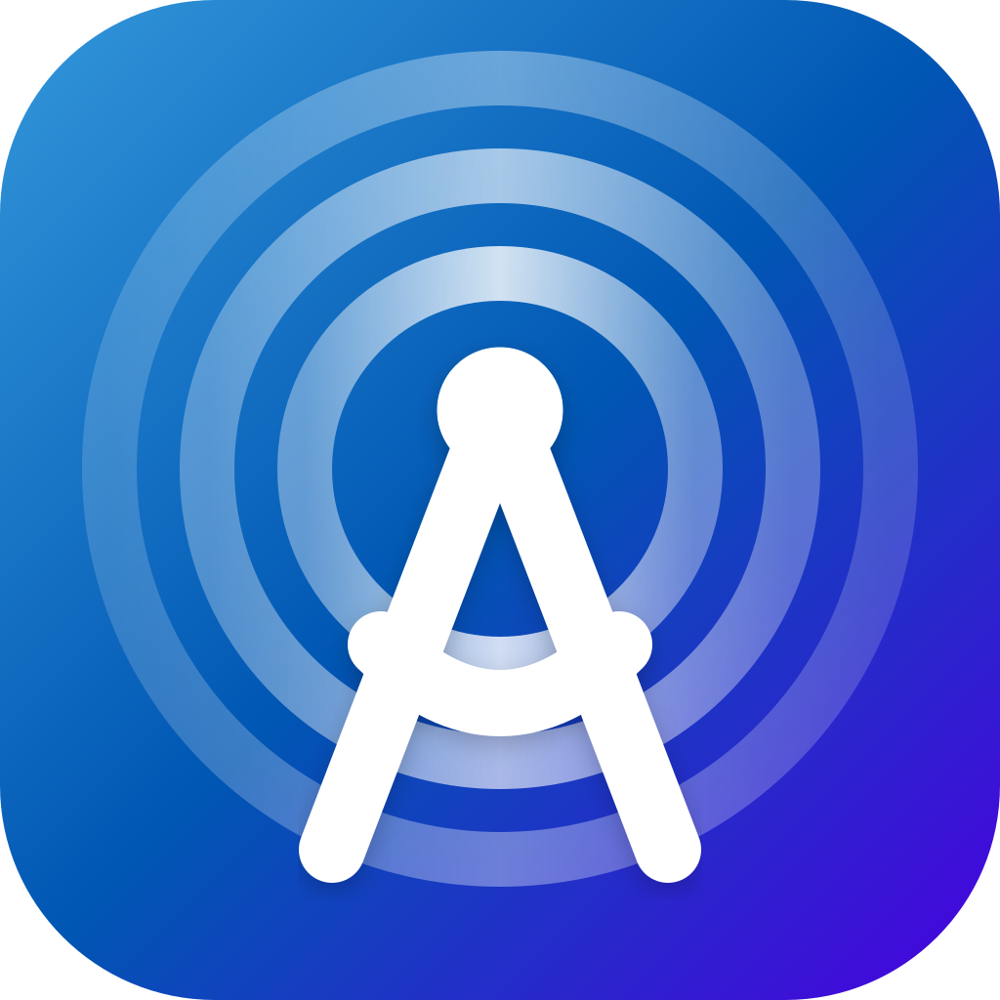
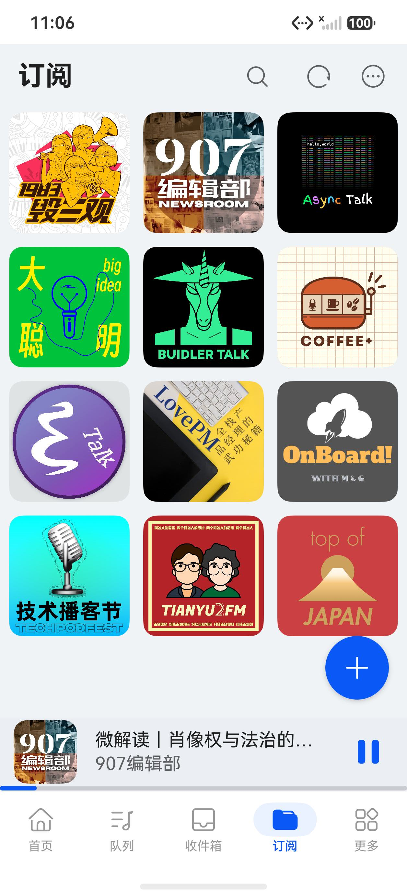
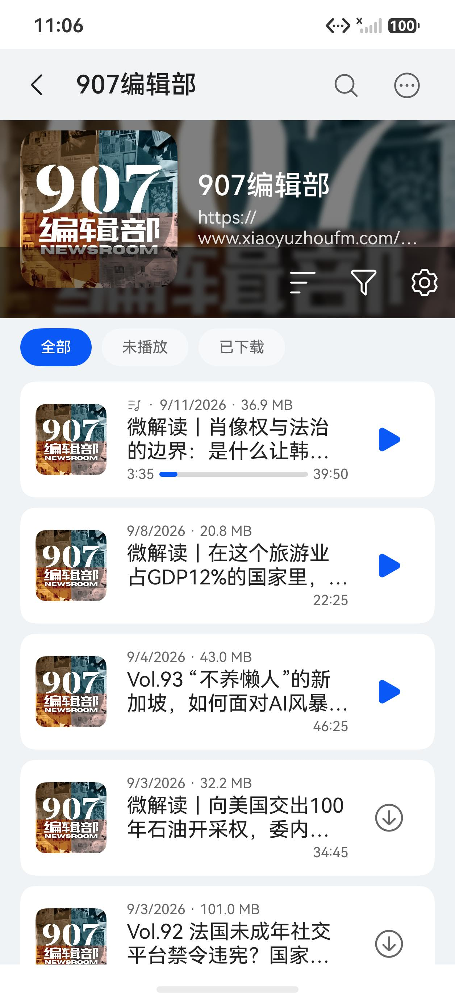
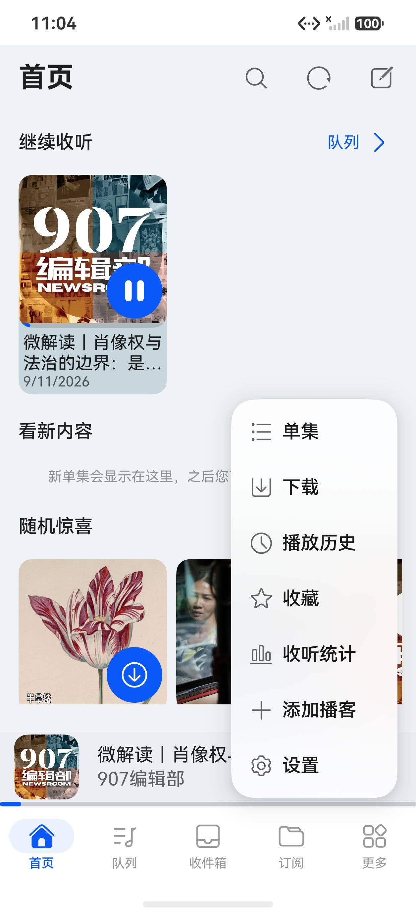
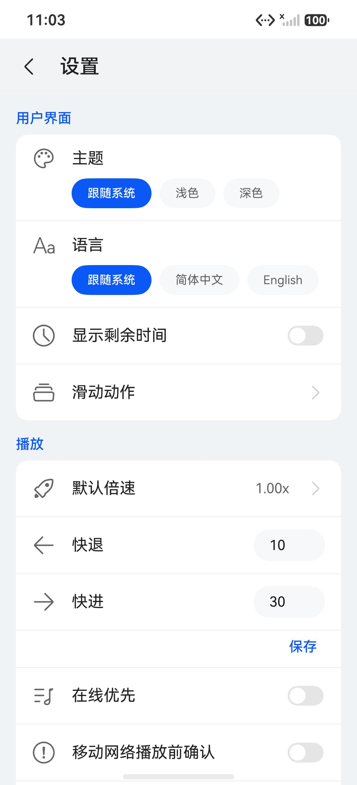
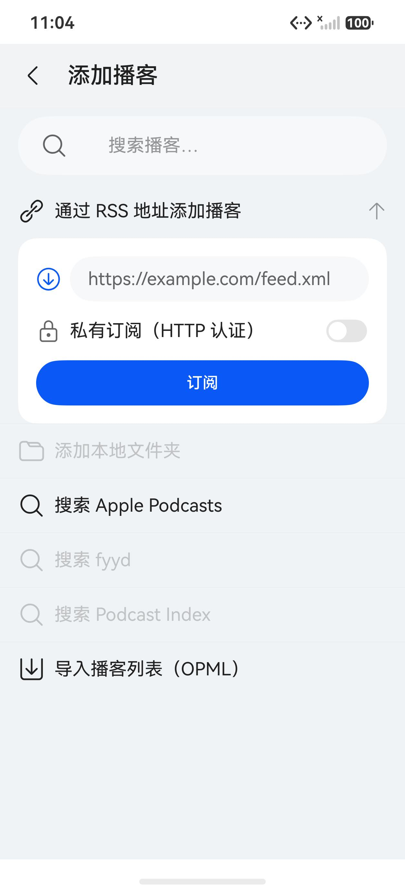
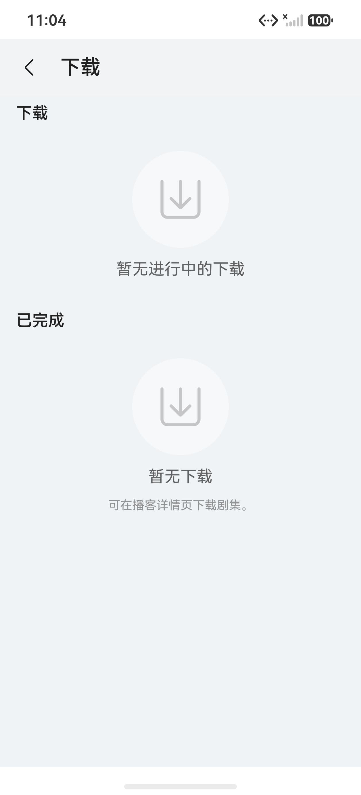
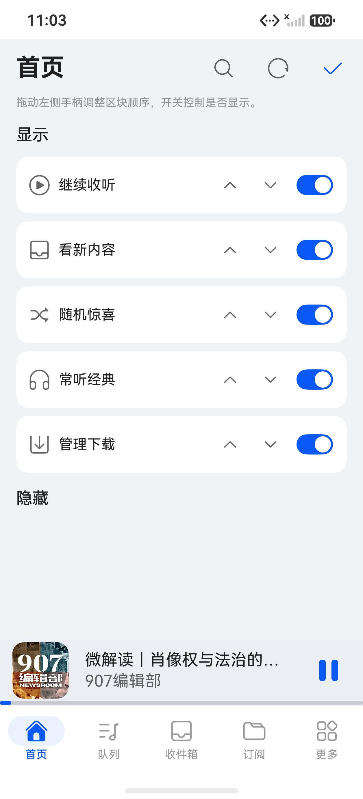
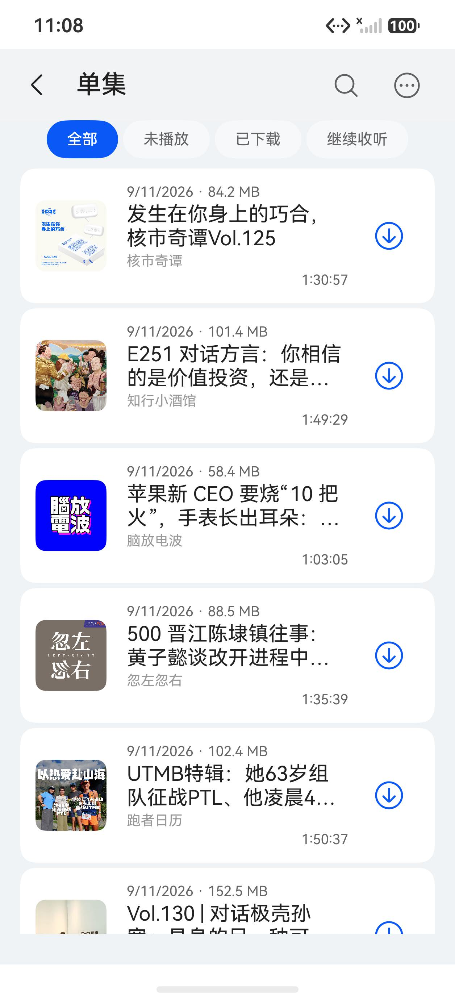

# HomenaPod

**HomenaPod** 是开源播客应用 [AntennaPod](https://github.com/AntennaPod/AntennaPod) 的 **HarmonyOS NEXT 原生移植版** —— 一个易用、灵活、开源的鸿蒙播客管理器（ArkTS / ArkUI）。

[](https://www.gnu.org/licenses/gpl-3.0)
[](#技术栈)
[](#技术栈)
[](https://github.com/AntennaPod/AntennaPod)

---

## 🧬 纯 Vibe Coding 项目声明

> **本项目是一个纯 vibe coding 项目。** 仓库中的全部代码、资源与文档，都是由 **DeepSeek** 大模型在 **DeepSeek Harness（DSH）** 智能体框架下，通过自然语言对话驱动生成的，不存在传统意义上「人工逐行编写」的代码。

具体来说：

- **AI 生成了什么**：工程骨架与构建配置、数据层（`relationalStore` + `preferences`）、RSS/Atom/iTunes 解析器、`AVPlayer` 播放内核、`AVSession` 播控、后台长时任务、下载管理、定时刷新、全部 ArkUI 页面与复用组件、三语资源、校验脚本，以及**本文档与文内全部截图**。
- **怎么生成的**：在 **DeepSeek Harness（DSH）** 智能体框架中，以自然语言需求为输入，按「提出需求 → 改代码 → `arkts_check` 静态检查 → `hvigor` 编译 → 装到模拟器 → `hdc` 截屏 / dump 取证 → 再改」的闭环迭代产出。上游对照结论沉淀在本仓库的 `docs/`（`07-ui-layout-parity.md` 逐屏对齐口径、`feature-diff/` 逐域差异分析、`harmony-counterparts.md` 平台能力对照），可直接作为审阅入口。
- **人做了什么**：提出需求、按上游 AntennaPod 的 UI 与语义逐项做「与上游同步 / 保持当前」的取舍、在模拟器上验收并给出反馈。**没有人工逐行编写或重构代码。**
- **这意味着什么**：代码风格、注释密度与架构取舍反映的是模型在多轮对话中的决策，工程质量以「能否在上游语义下跑通并上机取证」为准，而非人工精雕细琢。请把它当作一个 AI 生成的 GPL-3.0 开源项目来审阅、使用与改进。

## 上游来源

本项目的功能语义、UI 相对布局（结构 / 顺序 / 层级 / 操作位次）与数据库表结构，均以 **AntennaPod** 为蓝本逐项对齐：

| 项 | 值 |
|---|---|
| 上游仓库 | <https://github.com/AntennaPod/AntennaPod> |
| 参考快照 | `develop` 分支 @ `8024391`（2026-09-07，本地只读浅克隆于 `antenna-repo/`） |
| 移植方式 | 按上游模块语义用 ArkTS/ArkUI **重新实现**，不搬运 Android 源码；源文件头部以 `// Port of: <上游相对路径>` 标注对应关系，便于逐项比对与回归 |
| 上游协议 | GNU General Public License v3.0 |

本项目的名称、包名、图标与文案均已与上游区分（应用名 `HomenaPod`、bundleName `com.homenapod.app`、自有 SVG 图标），**不使用 AntennaPod 的名称或标识作为产品标识**；上游名称仅在「来源与许可」语境中作事实性引用，不暗示上游对本项目的背书。完整归属与商标声明见 [`antennapod-harmony/NOTICE.md`](antennapod-harmony/NOTICE.md)。

## 截图

> 以下截图全部由 DSH 通过 `hdc` 在 **HarmonyOS 模拟器**（`127.0.0.1:5555`，HarmonyOS `7.0.0.106`，API 26，x86_64）上实时抓取，界面语言为简体中文，数据为真实导入的 87 个订阅 / 1.5 万余条单集。

| 首页 | 队列 | 收件箱 |
|---|---|---|
|  |  |  |
| 区块化首页：继续收听 / 看新内容 / 随机惊喜 / 常听经典，底部常驻迷你播放条 | 队列信息条「N 集 · 剩余时长」、拖拽手柄、行内进度与播放控制 | 只列「新」单集的三态收件箱，右滑入队 / 左滑标已播 |

| 订阅 | 订阅详情 | 播放页 |
|---|---|---|
|  |  |  |
| 封面网格 + 计数胶囊 + 标签筛选 + 右下角 FAB（长按瓦片进入多选） | 头图 + 封面 + 全部 / 未播放 / 已下载 过滤，行内下载与进度环 | 单集封面、进度条、倍速 / 快退 / 播放 / 快进 / 下一集、睡眠定时 |

| 「更多」溢出菜单 | 设置 | 添加播客 |
|---|---|---|
|  |  |  |
| 底栏第 5 项，收纳单集总表 / 下载 / 历史 / 收藏 / 统计 / 添加播客 / 设置 | 主题三态、语言切换、播放参数、存储与定时刷新 | RSS 地址、私有订阅、Apple Podcasts / fyyd / Podcast Index 搜索、OPML 导入 |

| 下载管理 | 首页布局配置 | 单集总表 |
|---|---|---|
|  |  |  |
| 「下载中」与「已完成」分组，失败原因分类与行内重试 | 拖动调整首页区块顺序、开关控制各区块显示 | 全部订阅的单集聚合视图，4 种过滤、6 种排序、长按多选 |

## 功能特性

- **订阅管理**：RSS / Atom 抓取入库，iTunes Search、fyyd、Podcast Index 搜索发现，私有订阅 HTTP Basic 认证，OPML 批量导入导出，标签体系，封面网格（1–5 列）/ 列表，排序、过滤器与计数口径，长按多选批量操作。
- **播放**：`AVPlayer` 流播放与本地播放，`AVSession` 锁屏 / 播控中心，`AUDIO_PLAYBACK` 后台长时任务，0.5–2.0 六档倍速（含每订阅倍速），快进快退可配置，跳片头 / 片尾，音量适配，重复播放（关 / 单集 / 列表），睡眠定时器（预设 + 自定义 + 渐弱 + 震动），耳机与蓝牙中断自动暂停恢复。
- **队列**：持久化队列 + 内存引擎（串行化写入，避免并发清空），拖拽排序（浮层跟手 + 相邻行让位动画），6 种排序与随机 / 智能乱序，入队位置（队首 / 队尾 / 当前之后），队列锁定，多选批量，自动连播。
- **收件箱**：三态 `read`（`-1` 新 / `0` 未播放 / `1` 已播放），右滑入队、左滑标已播「拖过动作区松手即执行」，一键全部移出。
- **单集总表**：全部订阅的单集聚合视图，4 种过滤、6 种排序，行内播放 / 下载，长按多选批量（标已播 / 未播、入队、下载、删除文件）。
- **下载**：`@ohos.request` 封装，实时进度环（含排队等待态）、暂停 / 继续 / 取消 / 删除、失败原因分类与重试、下载日志，自动下载（仅 WiFi / 仅充电 / 集数上限）、播放后自动删除、存储管理页。
- **后台与通知**：`workScheduler` 定时刷新（最小 2 小时），按订阅聚合的新单集通知，新单集动作（全局 / 加入收件箱 / 不处理 / 加入队列）。
- **其它**：收听统计（按月 / 按订阅）、播放历史、收藏、章节数据层、应用内语言切换、深浅色主题。

## 技术栈

| 层 | 选型 |
|---|---|
| 平台 | HarmonyOS NEXT，`compatibleSdkVersion` `5.0.0(12)` |
| 语言 / UI | ArkTS（严格模式）+ ArkUI 声明式 |
| 存储 | `relationalStore`（复用 AntennaPod 表结构）+ `preferences` |
| 播放 | `AVPlayer` + `AVSession` + `AUDIO_PLAYBACK` 长时任务 |
| 网络 | `@ohos.net.http`，自研 `XmlReader` / `FeedParser`（Rss20 / Atom / iTunes / Media / PodcastIndex） |
| 下载 | `@ohos.request` 系统下载任务 |
| 后台 | `@ohos.resourceschedule.workScheduler` |
| 模块 | 单 `entry` 模块分层（`model` / `db` / `net` / `parser` / `player` / `download` / `services` / `pages` / `components`） |

## 构建

需要 **DevEco Studio 5.x 及以上**（本项目在 DevEco Studio `26.0.0.821` + HarmonyOS SDK `26.0.0.105` 下验证）与配套的 `hvigorw` / `ohpm`。

```bash
cd antennapod-harmony
export DEVECO_SDK_HOME="/path/to/DevEco Studio/sdk"   # Windows 用 set / $env:

# 编译打包（debug）
hvigorw --mode module -p product=default -p buildMode=debug assembleHap --no-daemon
# 产物：entry/build/default/outputs/default/entry-default-unsigned.hap

# 清理
hvigorw clean --no-daemon
```

装到设备 / 模拟器需要签名：在 DevEco Studio 中开启自动签名（生成 `signingConfigs` 并写入 `antennapod-harmony/build-profile.json5`），详细步骤见 `docs/signing-guide.md`。工具链就绪后也可直接用工程内脚本：

```bash
bash antennapod-harmony/scripts/build.sh
```

**不依赖 DevEco 的静态校验**（把非 ArkUI 文件转为 TS + 平台桩声明后跑 `tsc --noEmit`）：

```bash
bash antennapod-harmony/scripts/static-check.sh    # 静态类型检查
bash antennapod-harmony/scripts/check-project.sh   # 路径 / 导入 / 三语资源 / 页面注册 / 非 UI 层检查
bash antennapod-harmony/scripts/runtime-pure-test.sh  # 纯逻辑（时长 / 日期 / MIME / 清洗 / 可播放）Node 断言
bash antennapod-harmony/scripts/env-report.sh      # 环境与工具链诊断
```

## 反馈

讨论、Bug 报告与功能建议请提交到**本仓库的 Issue**（若你在本地或镜像上使用，也可直接修改后回提 Patch）。提交前请尽量附上：

- 设备 / 模拟器型号与 HarmonyOS 版本；
- 复现步骤与预期行为；
- `hdc hilog` 相关日志或 `hdc crash` 抓取的崩溃记录；
- 如果是 UI 差异，请说明对应的上游 AntennaPod 行为（本项目的对齐口径是**相对布局**，控件保持鸿蒙原生）。

## 帮助我们测试

本项目目前**只在 HarmonyOS 模拟器上做过系统性验收**，真机覆盖还很薄。欢迎帮忙：

- 在真机（不同屏幕尺寸 / 刷新率 / HarmonyOS 版本）上安装试用，反馈布局与手势问题；
- 用你自己的 OPML 订阅列表做一次全量导入 + 刷新，观察抓取、封面、计数与下载是否正常；
- 验证后台播放、锁屏播控、定时刷新与通知在真实系统策略下的表现；
- 复现上游 AntennaPod 的既有行为差异，帮助逐项收敛。

> 已知事项：本项目使用**未签名 / 自签名** HAP 在模拟器上验证，真机安装需按上面的「构建」一节配置签名。

## 开源协议

本项目与上游 **AntennaPod 保持一致，采用 GNU General Public License v3.0（GPL-3.0）** 授权，许可全文见仓库根目录的 [`LICENSE`](LICENSE)（与上游 `LICENSE` 完全一致）。

- Harmony 工程内 `entry/oh-package.json5` 已声明 `"license": "GPL-3.0-only"`；
- 由于本项目是 AntennaPod 的移植衍生作品，**分发或再发布时必须保留**：本 README 的来源说明、[`antennapod-harmony/NOTICE.md`](antennapod-harmony/NOTICE.md)、全部 `// Port of:` 上游来源注释，以及 GPL 许可声明与完整许可全文；
- 任何再分发者同样必须以 GPL-3.0 授权其衍生作品。

## 汉化与翻译

本项目内置三语资源，位于 `antennapod-harmony/entry/src/main/resources/`：

| 目录 | 语言 |
|---|---|
| `base/element/string.json` | 默认（英文） |
| `zh_CN/element/string.json` | 简体中文 |
| `en_US/element/string.json` | 英文 |

应用内可在「设置 → 语言」中切换「跟随系统 / 简体中文 / English」。若要新增语言，请按 `base` 的键位补齐一份 `values` 目录并保证三个文件键位对齐（`scripts/check-project.sh` 会校验三语资源对齐）。翻译文案参考上游 AntennaPod 在 [Weblate](https://hosted.weblate.org/projects/antennapod/) 上的既有译法，以便术语统一。

## 仓库结构

```
antennapod-harmony/
├── README.md                  ← 本文件
├── LICENSE                    ← GPL-3.0 全文（与上游一致）
├── PLAN.md                    ← 移植总计划（目标 / 范围 / 里程碑 / 执行规则）
├── docs/                      ← 设计与对照文档
│   ├── images/                ← 本文档使用的模拟器截图
│   ├── 01-architecture.md     ← 架构设计、Android→鸿蒙 API 映射、播放器状态机
│   ├── 02-task-list.md        ← 顺序任务清单（T0–T6）
│   ├── 03-project-templates.md ← DevEco 工程骨架模板
│   ├── 04-data-schema.md      ← 数据库 DDL 与 ArkTS 数据模型
│   ├── 05-risks-and-verification.md ← 风险登记与验收场景
│   ├── 06-ui-design-spec.md / 07-ui-layout-parity.md ← UI 规格与上游布局对齐口径
│   ├── feature-diff/          ← 上游 vs 移植版逐域差异分析
│   ├── harmony-counterparts.md ← Android 能力 → 鸿蒙等价物对照
│   ├── _ref-spec-*.md         ← 上游 UI/交互规格摘录（对齐依据）
│   ├── reference-notes.md     ← 上游源码研读索引
│   └── release-checklist.md / signing-guide.md ← 发布与签名
├── antenna-repo/              ← 上游 AntennaPod 源码浅克隆（只读参考，不纳入仓库）
└── antennapod-harmony/        ← HarmonyOS NEXT 工程（DevEco Studio 直接打开）
    ├── AppScope/              ← 应用级配置与图标
    ├── entry/                 ← 唯一模块：ets/（model·db·net·parser·player·download·services·pages·components）
    ├── scripts/               ← 构建与校验脚本
    └── NOTICE.md              ← 来源与许可/商标声明
```

## 已知限制与路线图

**平台能力限制（非缺陷）**

- **跳过静音**：`AVPlayer` 没有等价能力，对应设置项以禁用态呈现（结论见 `docs/harmony-counterparts.md`）。
- **系统分享面板**：当前 SDK 无对应 API，分享以「复制链接」实现。
- **定时刷新**：`workScheduler` 最小间隔 2 小时。
- **下载断点续传**：依赖系统 `DownloadTask`，个别 API 版本可能需要手写 Range 下载作为 Plan B。

**待办方向**

- 真机覆盖与签名流程完善；
- 超大订阅库下的列表首屏性能（单集总表在 1.5 万条规模下的加载耗时）；
- WearOS / 投屏 / 转录 / 自动清理等上游能力的评估与排期；
- UI 与上游 AntennaPod 的逐屏差异继续收敛（口径见 `docs/07-ui-layout-parity.md`）。

